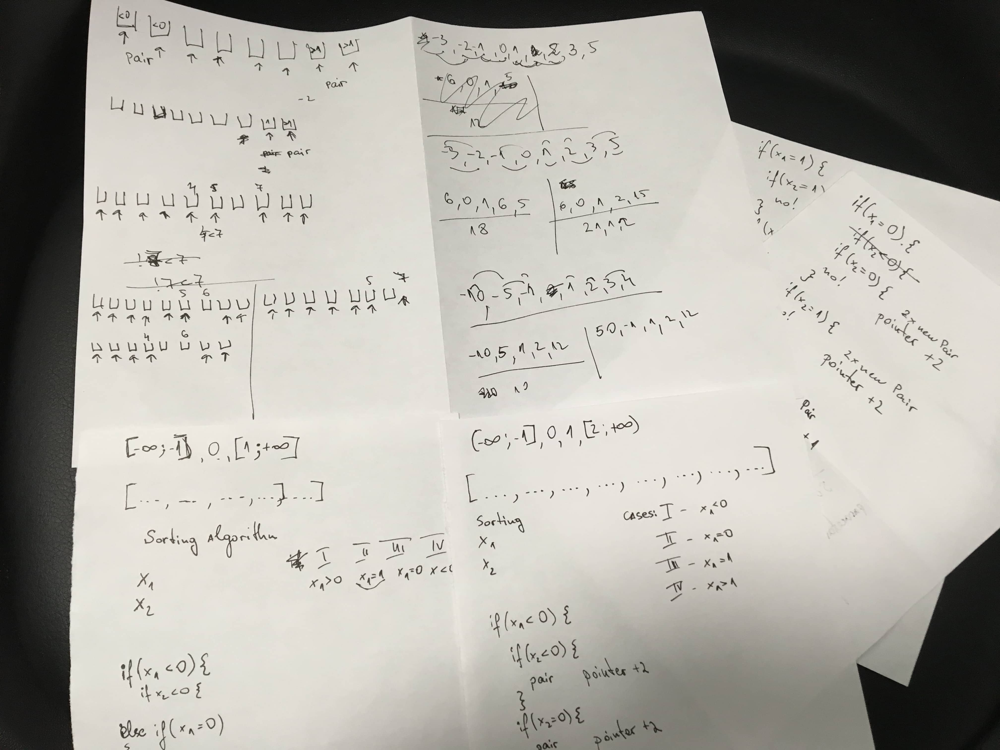

### Challenge #1

The challenge was interesting and I enjoyed it a lot. 
I went through a lot of brainstorming as you can see.

For the solution I used Java 8. 
For sorting the input list I used Quick sort executed in separate methods,  
I created a simple entity to construct my pairs and everything else is the pairing algorithm.  
The algorithm itself iterates through the list once which makes it with time complexity of O(n) 
and the sorting algorithm is additional O(n log n) on average.